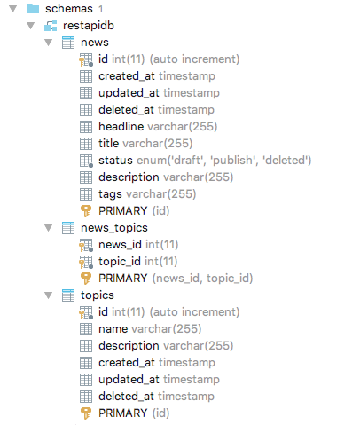

# NEWS REST API

# Requirements
  - Go
  - MySql
  
# Database Configuration
 Edit file `database/Database.go`
        
    const (
	    USERNAME = "user_name"
	    PASSWORD = "user_password"
	    HOST     = "host"
	    PORT     = "port"
	    DATABASE = "database_name"
    )
    
  Example :
  
    const (
	    USERNAME = "root"
	    PASSWORD = "root"
	    HOST     = "localhost"
	    PORT     = "3306"
	    DATABASE = "restapidb"
    )
    
# Schema Database

# Running

Install glide (Package Management for Golang) :

        $ curl https://glide.sh/get | sh
        
        
Install dependancies use glide :

        $ glide install
        
        
To run all tests :

        $ go run web.go

# Testing

Install ginkgo :

        $ go get -u github.com/onsi/ginkgo

To run all tests :

        $ ginkgo -r src/tests/

# API Resources

  - [News](#news)
  - [Topics](#topics)

## News

### List News

    GET localhost:9000/news

Using :

    curl --request GET localhost:9000/news

Response :

    {
        "data": {
            "news": [
                {
                    "id": 1,
                    "created_at": "2018-02-22T00:04:29+07:00",
                    "updated_at": "2018-02-22T00:04:29+07:00",
                    "deleted_at": null,
                    "headline": "Headline 1",
                    "title": "Title 1",
                    "Status": "publish",
                    "description": "This is News 1 description",
                    "tags": "tag1, tag2",
                    "topics": [
                        {
                            "id": 1,
                            "name": "Topic 1",
                            "description": "this is description topic 1"
                        },
                        {
                            "id": 2,
                            "name": "Topic 2",
                            "description": "this is description topic 2"
                        }
                    ]
                },
                {
                    "id": 2,
                    "created_at": "2018-02-22T00:04:29+07:00",
                    "updated_at": "2018-02-22T00:04:29+07:00",
                    "deleted_at": null,
                    "headline": "Headline 2",
                    "title": "Title 2",
                    "Status": "draft",
                    "description": "This is News 2 description",
                    "tags": "tag3, tag4",
                    "topics": [
                        {
                            "id": 2,
                            "name": "Topic 2",
                            "description": "this is description topic 2"
                        }
                    ]
                },
                {
                    "id": 3,
                    "created_at": "2018-02-22T00:04:29+07:00",
                    "updated_at": "2018-02-22T00:04:29+07:00",
                    "deleted_at": null,
                    "headline": "Headline 3",
                    "title": "Title 3",
                    "Status": "draft",
                    "description": "This is News 3 description",
                    "tags": "tag5, tag6",
                    "topics": [
                        {
                            "id": 1,
                            "name": "Topic 1",
                            "description": "this is description topic 1"
                        },
                        {
                            "id": 3,
                            "name": "Topic 3",
                            "description": "this is description topic 3"
                        }
                    ]
                }
            ]
        },
        "status": "success"
    }
       
       

### Show News By Id

    GET localhost:9000/news/{id}

Using :

    curl --request GET localhost:9000/news/1

Response :

    {
        "data": {
            "news": {
                "id": 1,
                "created_at": "2018-02-22T00:31:56+07:00",
                "updated_at": "2018-02-22T00:31:56+07:00",
                "deleted_at": null,
                "headline": "Headline 1",
                "title": "Title 1",
                "Status": "publish",
                "description": "This is News 1 description",
                "tags": "tag1, tag2",
                "topics": [
                    {
                        "id": 1,
                        "name": "Topic 1",
                        "description": "this is description topic 1"
                    },
                    {
                        "id": 2,
                        "name": "Topic 2",
                        "description": "this is description topic 2"
                    }
                ]
            }
        },
        "status": "success"
    }
    
    
### List News By Topic

    GET localhost:9000/news?topicId={id}

Using :

    curl --request GET localhost:9000/news?topicId=1

Response :

    {
        "data": {
            "news": [
                {
                    "id": 1,
                    "created_at": "2018-02-22T00:04:29+07:00",
                    "updated_at": "2018-02-22T00:04:29+07:00",
                    "deleted_at": null,
                    "headline": "Headline 1",
                    "title": "Title 1",
                    "Status": "publish",
                    "description": "This is News 1 description",
                    "tags": "tag1, tag2",
                    "topics": [
                        {
                            "id": 1,
                            "name": "Topic 1",
                            "description": "this is description topic 1"
                        },
                        {
                            "id": 2,
                            "name": "Topic 2",
                            "description": "this is description topic 2"
                        }
                    ]
                },
                {
                    "id": 3,
                    "created_at": "2018-02-22T00:04:29+07:00",
                    "updated_at": "2018-02-22T00:04:29+07:00",
                    "deleted_at": null,
                    "headline": "Headline 3",
                    "title": "Title 3",
                    "Status": "draft",
                    "description": "This is News 3 description",
                    "tags": "tag5, tag6",
                    "topics": [
                        {
                            "id": 1,
                            "name": "Topic 1",
                            "description": "this is description topic 1"
                        },
                        {
                            "id": 3,
                            "name": "Topic 3",
                            "description": "this is description topic 3"
                        }
                    ]
                }
            ]
        },
        "status": "success"
    }
    
    
    
### List News By Status

    GET localhost:9000/news?status={status}

Using :

    curl --request GET localhost:9000/news?status=publish

Option Status :

    status : publish, draft, deleted

Response :

    {
        "data": {
            "news": [
                {
                    "id": 1,
                    "created_at": "2018-02-22T00:04:29+07:00",
                    "updated_at": "2018-02-22T00:04:29+07:00",
                    "deleted_at": null,
                    "headline": "Headline 1",
                    "title": "Title 1",
                    "Status": "publish",
                    "description": "This is News 1 description",
                    "tags": "tag1, tag2",
                    "topics": [
                        {
                            "id": 1,
                            "name": "Topic 1",
                            "description": "this is description topic 1"
                        },
                        {
                            "id": 2,
                            "name": "Topic 2",
                            "description": "this is description topic 2"
                        }
                    ]
                }
            ]
        },
        "status": "success"
    }

    
### List News By Status and Topic

    GET localhost:9000/news?status={status}&topicId={topicId}

Using :

    curl --request GET localhost:9000/news?status=publish&topicId=1

Option Status :

    status : publish, draft, deleted
    
Response :

    {
        "data": {
            "news": [
                {
                    "id": 1,
                    "created_at": "2018-02-22T22:35:26+07:00",
                    "updated_at": "2018-02-22T22:35:26+07:00",
                    "deleted_at": null,
                    "headline": "Headline 1",
                    "title": "Title 1",
                    "status": "publish",
                    "description": "This is News 1 description",
                    "tags": "tag1, tag2",
                    "topics": [
                        {
                            "id": 1,
                            "name": "Topic 1",
                            "description": "this is description topic 1"
                        },
                        {
                            "id": 2,
                            "name": "Topic 2",
                            "description": "this is description topic 2"
                        }
                    ]
                }
            ]
        },
        "status": "success"
    }

### Create News

    POST localhost:9000/news

Using :

    curl --request POST localhost:9000/news -H "Content-type: application/json" --data  "{ \"headline\": \"headline\", \"title\": \"title\", \"description\": \"this is description\", \"tags\": \"tag, tes\", \"status\" : \"draft\" }"

Request Example :

    {
    	"headline": "headline",
    	"title": "title",
    	"description": "this is description",
    	"tags": "tag, tes",
    	"status" : "draft"
    }

### Edit news

    PUT localhost:9000/news/{id}

Using :

    curl --request PUT localhost:9000/news/1 -H "Content-type: application/json" --data "{ \"headline\": \"headline\", \"title\": \"title\", \"description\": \"this is description\", \"tags\": \"tag, tes\", \"status\" : \"draft\" }"

Request example:

    {
    	"headline": "headline",
    	"title": "title",
    	"description": "this is description",
    	"tags": "tag, tes",
    	"status" : "draft"
    }
    

### Delete News

    DELETE localhost:9000/news/{id}

Using :

    curl --request DELETE localhost:9000/news/1

Response :

    {
        "data": null,
        "status": "success"
    }
    

## Topics

### List Topics

    GET localhost:9000/topics

Using :

    curl --request GET localhost:9000/topics

Response :

    {
        "data": {
            "topics": [
                {
                    "id": 1,
                    "name": "Topic 1",
                    "description": "this is description topic 1"
                },
                {
                    "id": 2,
                    "name": "Topic 2",
                    "description": "this is description topic 2"
                },
                {
                    "id": 3,
                    "name": "Topic 3",
                    "description": "this is description topic 3"
                }
            ]
        },
        "status": "success"
    }

### Create Topics

    POST localhost:9000/topics

Using :

    curl --request POST localhost:9000/topics -H "Content-type: application/json" --data "{\"name\" : \"Topic Politik\"}"

Request example:

    {
        "name": "Topic Politik"
    }

### Edit Topics
    
    PUT localhost:9000/topics/{id}

Using :

    curl --request POST localhost:9000/topics/1 -H "Content-type: application/json" --data "{\"name\" : \"Topic Politik\"}"

Request example:

    {
        "name": "Topik Ekonomi "
    }

### Delete Topics

    DELETE localhost:9000/topics/1

Using :

    curl --request DELETE localhost:9000/topics/1

Response :

    {
        "data": null,
        "status": "success"
    }
    